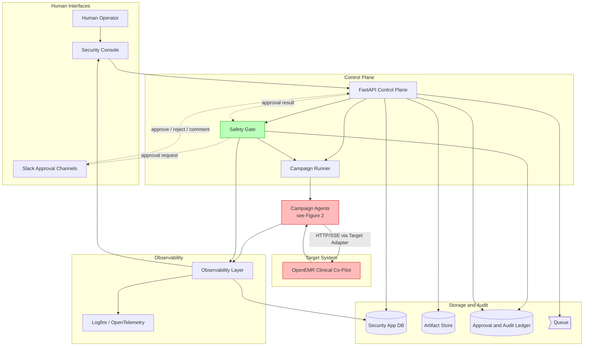
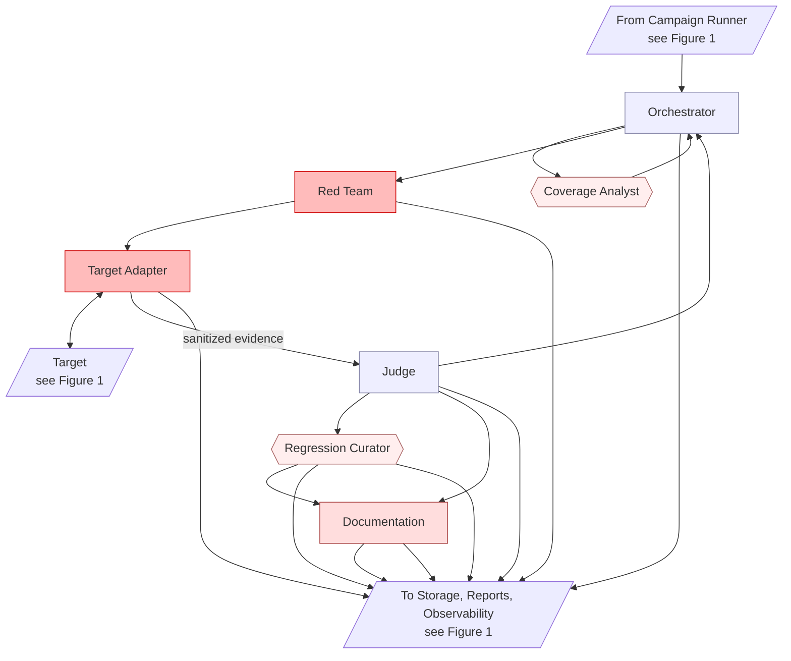

# ARCHITECTURE.md Fix Plan

Source: synthesis of four parallel reviews of `ARCHITECTURE.md` (Mermaid syntax + structure, diagram↔prose correspondence, whole-doc coherence, completeness/gaps). All findings are deduplicated and grouped into work units (WUs) below.

The plan has nine phases. Phases 1–3 are decisions and prep that block other edits. Phases 4–8 are the bulk of the doc work and can be parallelized within each phase. Phase 9 is end-to-end validation.

Conventions:
- Line refs are against the current `ARCHITECTURE.md`.
- Each WU has: **Scope · Decision needed · Edit · Validation**.
- "Decision needed: none" means the WU can proceed without input from the team.
- Severity tags: 🔴 contradiction (reader will diverge), 🟠 gap (missing required content), 🟡 ambiguity (will cause re-litigation), ⚪ polish (clarity/style). **Tags indicate type, not execution priority — see "Suggested execution order" for sequencing.**

---

## Phase 1 — Decisions and Calibration Defaults

Phase 1 splits into three groups by decision shape:

- **Group A — Must-decide up-front (5):** architecture- or code-organization-shaping. Block downstream WUs until resolved.
- **Group B — Branching logic (2):** real branching that affects more than a single numeric value. Block downstream WUs.
- **Group C — Calibration defaults (5):** tuning numbers you cannot pick well without campaign data. Each gets a defensible default written into ARCHITECTURE.md plus a Calibration Protocol note. Downstream WUs use the default and don't wait.

Capture each resolved decision (or default) in the "Open Decisions" section as you resolve it so the trail is preserved.

### Group A — Must-decide up-front

| # | Decision | Why it blocks |
|---|---|---|
| D1 | Single canonical severity scale: keep difficulty Low/Med/High (L627-637) **and** report severity Critical/High/Med/Low/Informational (L968-975), or collapse to one? If both, define the mapping. | Blocks WU-15 (severity unification), WU-18 (promotion flow), and Approval-gate logic (L765, L769). |
| D2 | Real-PHI policy in MVP: absolute prohibition (L40, L1057) or conditional with approval (L115)? **Regardless of path chosen, ARCHITECTURE.md must add a "Production-Data Policy" subsection specifying: (1) BAA requirement and counterparty; (2) data-at-rest encryption standard (e.g., AES-256, scope: disk vs. column); (3) data-in-transit encryption (TLS 1.2+ minimum); (4) de-identification standard (HIPAA Safe Harbor or Expert Determination); (5) retention period for PHI-touching artifacts; (6) mandatory audit log fields for PHI-touching operations; (7) deletion procedure (cryptographic erasure vs. overwrite).** If MVP path is "absolute prohibition," items 1-7 are still documented as the pre-committed floor for any future carve-out. | Blocks WU-12 (synthetic-data wording), the new "Production-Data Policy" subsection, and any PHI-touching fields surfaced by WU-25 (agent attribute matrix). |
| D3 | "Approved target" mechanism: where is the allowlist stored, who authorizes, what's the record schema? | Blocks WU-19 (allowlist schema) and Safety Gate spec (L226). |
| D5 | Persistence transition triggers: SQLite→Postgres (L125), FileStatePersistence→DB persistence (L178), CLI→queue (L126). Name a measurable trigger for each or remove the migration story. | Blocks WU-2 (storage subsection), WU-11 (Postgres reconciliation), and transitively WU-22 (via WU-2). |
| D12 | Reconciliation with PRD submission rule "GitHub Repository forked from OpenEMR": is `security-auto/` graded standalone, or hosted as a sibling inside the OpenEMR fork? | Blocks Separation Boundary section edits; affects README structure (README authorship itself out of plan scope). |
| D13 | **Secrets management strategy.** Specify: (a) secret manager backend (Railway env vars / `.env` file / Vault / AWS Secrets Manager); (b) per-component read-access matrix (e.g., Red Team agent process must NOT read the OpenEMR internal token; Judge process must NOT read SMART client secret); (c) minimum rotation cadence per secret type (Slack signing key, model API keys, internal tokens); (d) environment separation enforcement (dev / staging / prod); (e) prohibition on env inheritance to red-team agent subprocesses. | Blocks WU-2b (Secrets subsection) and shapes how agent processes are spawned in code. |

### Group B — Branching logic

| # | Decision | Why it blocks |
|---|---|---|
| D4 | `invalid` / `uncertain` verdict handling: retry? human review? regression-blocking? Different paths require different code branches. | Blocks WU-14 (verdict handling rules) and Judge row of WU-25. (Note: WU-29 — regression trigger mechanism — is NOT blocked by D4. Trigger mechanism is an implementer call at code time; no separate decision required.) |
| D11 | Disclosure flow destination: where do "external disclosure" reports go (L783)? Email? GitHub Issues? Ticketing? Affects what code path Documentation Agent writes. | Blocks WU-30 (Documentation Agent disclosure flow). |

### Group C — Calibration defaults (set default, document the tuning trigger)

Each entry below ships a defensible default into ARCHITECTURE.md. Downstream WUs use the default. Tune after the named trigger.

| # | Decision | Suggested default | Calibration trigger |
|---|---|---|---|
| D6 | Coverage scoring weights (L280-289, all 7 weights). | All weights = 1.0 initially (uniform). Document the formula as `priority = sum(weighted_terms)` where each weight defaults to 1.0. | After first 100 campaign attempts, rank categories by signal-to-cost ratio and re-weight. |
| D7 | Auto-reject TTL value for Slack approvals (L795). | 24 hours. | Tune if 24h auto-rejects exceed 10% of approval requests. |
| D8 | Judge calibration cadence (L409 "periodic"). | Re-run the golden-transcript set weekly, and on every Judge prompt or model change. | Reduce to daily if Judge-vs-human agreement drops below 85%. |
| D9 | Regression promotion confidence threshold (L433-440 "high-confidence"). | `confidence >= 0.85` for `partial` verdicts; all `fail` verdicts promote regardless of confidence (subject to severity gate). | Tune after first regression false-positive incident. |
| D10 | Severity threshold that flips `requires_human_review` on Judge verdicts (L585). | `severity in {High, Critical}` OR `confidence < 0.70`. | Tune if human reviewers report >30% of flagged verdicts are trivial. |

**Acceptance for Phase 1:** Group A and B decisions written into "Open Decisions" as resolved; Group C defaults written into the relevant sections of ARCHITECTURE.md with their Calibration Protocol notes.

---

## Phase 2 — Structural / sequencing fixes

### WU-0b 🟠 Add document-header block (version, last-updated, decision log)
**Scope:** ARCHITECTURE.md goes through 40+ WUs and 13 team decisions. Without a version/last-updated/decision-log surface, a reader returning later cannot tell which decisions have landed or which version of the doc they're reading.
**Decision needed:** none.
**Edit:** At the very top of ARCHITECTURE.md, before the title, add a metadata block:

```
---
Version: 0.x (mark per change)
Last updated: YYYY-MM-DD
Decision log:
  - D1 — pending
  - D2 — pending
  - D3 — pending
  - D4 — pending
  - D5 — pending
  - D11 — pending
  - D12 — pending
  - D13 — pending
  - D6/D7/D8/D9/D10 — defaults set in Phase 1 Group C
Reviewers:
  - (your name + date when sections are reviewed)
---
```

As each decision resolves, replace `pending` with a one-line summary of the resolution and the date.

**Validation:** Reader can tell from line 1 of ARCHITECTURE.md which decisions are live vs. resolved.

### WU-0 🟠 Add Audience and Reading-Order preamble
**Scope:** ARCHITECTURE.md never states who it is for or how to read it. The implementing engineer (the doc's primary reader, who is also its author) needs an anchor so every other WU's priority is defensible against a stated reader.
**Decision needed:** none.
**Edit:** At the top of ARCHITECTURE.md, immediately after the title and before "Source PRD PDF" lines, add a block:

```
## Audience and Reading Order

This document is the implementation reference for the engineer building `security-auto`. It exists to remind the author what is being built and how to build it.

- Open this doc when stuck mid-implementation and needing to remember a committed decision, a schema, a tool boundary, or a failure-mode plan.
- Reading order for first pass: Executive Summary → Goals/Non-Goals → System Architecture → Agent Roles → Data Contracts → Build Plan.
- Targeted reference during implementation: jump to the section that matches the file you are writing.
- Open Decisions is the live decision log; check there before treating any specific value as final.

The assignment's "defensible in front of a hospital CISO" standard remains the quality bar — but day-to-day, this is a builder's doc.
```

**Validation:** A reader who opens ARCHITECTURE.md cold knows in under 30 seconds who it is for and where to start.

### WU-1 🟠 Add a Data Contracts index after Inter-Agent Coordination
**Scope:** Data Contracts (L485-587) is forward-referenced by Inter-Agent Coordination (L188 mentions `AttackCase`) and every agent role. Moving the whole section earlier would trade one kind of forward reference for another (readers see schemas before they know which agents consume them). Better: add a short index/teaser where the forward references begin, keep full definitions where they are.
**Decision needed:** none.
**Edit:** Immediately after the "Inter-Agent Coordination" section, add a short subsection titled "Data Contracts at a Glance":

> The handoffs described above use these schemas, defined fully in §Data Contracts later in the doc:
> - **AttackCase** — a test case the Red Team executes (category, sequence, expected safe behavior, success criteria).
> - **AttackAttempt** — one execution of an AttackCase (IDs, target version, inputs, outputs, tool trace, cost).
> - **JudgeVerdict** — the Judge's evaluation of an AttackAttempt (status, confidence, severity, evidence).
> - **Message Envelope** — wraps every inter-agent handoff.

This preserves teach-then-spec reading order (agents introduced first) while eliminating dangling references.

**Validation:** Every `AttackCase` / `AttackAttempt` / `JudgeVerdict` mention before the full Data Contracts section is preceded by the at-a-glance index.

### WU-2 🟠 Add a "Storage and Transport" subsection
**Scope:** `PG`, `OBJ`, `QUEUE`, `AUDIT`, `LF`, `PYEVALS`, `EVALS` are diagram nodes with only one-line mentions. The completeness review flagged this as the largest prose gap.
**Decision needed:** D5 (persistence triggers).
**Edit:** Add a new section after "System Architecture" titled **"Storage, Transport, and Sinks"** with one subsection per node. Each subsection: purpose, backend choice (SQLite for PG; local FS for OBJ in MVP; queue tech TBD per D5; etc.), schema/contract, retention policy, auth model, failure behavior.
**Validation:** Every storage/transport node in the diagram has a prose subsection. Every `artifact://` reference resolves to OBJ. Every "audit event" mention resolves to AUDIT.

### WU-2b 🟠 Add a "Secrets" subsection
**Scope:** ARCHITECTURE.md states only "Environment-backed secret manager" with no details. Per D13, write the full spec.
**Decision needed:** D13.
**Edit:** Add a "Secrets" subsection under "Storage, Transport, and Sinks" (post WU-2). Cover D13's five items: backend, per-component read-access matrix (table form), rotation cadence per secret type, env separation, subprocess inheritance rule. Include the explicit list of secrets the platform handles (LLM provider keys, Slack signing key, SMART client secret, OpenEMR internal token, Logfire token, allowlist signing key if WU-19 ever ships it).
**Validation:** Reader can answer "which secret does the Red Team agent process have access to?" from one section.

### WU-3 🟠 Add a "Security Console" subsection
**Scope:** `UI` in the diagram is referenced (L138, L182, L711, L787, L921) but has no dedicated section. The doc also conflates "Security Console" with "dashboard."
**Decision needed:** none.
**Edit:** Add a subsection under "System Architecture" describing: console routes, auth model, what data it reads (results JSONL, AUDIT ledger, OBS metrics), what actions it triggers (campaign start, approval view, replay). State explicitly that "dashboard" is a Security Console view, not a separate component (or split them — pick one).
**Validation:** Every "dashboard" / "Security Console" / "UI" mention is consistent post-edit.

### WU-4 ⚪ Reconcile legacy diagram assets
**Scope:** L6-9 lists `docs/protective-security-agent-architecture.html`, slideshow HTML, `.pptx`, and an Excalidraw URL — never explained.
**Decision needed:** none (informational).
**Edit:** Either (a) mark each asset as "presentation only — Mermaid diagram in §System Architecture is canonical," or (b) remove the references entirely.
**Validation:** No unexplained file references in the header block.

### WU-5 ⚪ Phase deliverable grouping
**Scope:** Build Plan phases (L836-944) list deliverables as flat bullets mixing artifacts, workflows, acceptance criteria.
**Decision needed:** none.
**Edit:** For each phase, regroup bullets under **Artifacts**, **Acceptance Criteria**, **Dependencies**.
**Validation:** Each phase has three clear subsections.

---

## Phase 3 — Terminology canonicalization

### WU-6 🟡 Glossary + find-and-replace pass
**Scope:** Five drifting concepts with 3-4 variants each (Security Console / Eval system / Artifact storage / Control plane / Graph runner). Also agent name shortenings (Red Team Agent / Red Team / RT).
**Decision needed:** none, but **WU-3 must complete before WU-6 runs.** WU-3 (Security Console subsection) decides whether "dashboard" is a synonym for the Console (then canonicalize) or one VIEW of the Console (then keep both terms with defined relationship). Running WU-6 before WU-3 may erase a real structural distinction.
**Edit:** Add a "Glossary" section (suggested placement: right after "Recommended Stack") that picks one canonical form per concept and lists the variants. Then run a find-and-replace across the doc using:

| Canonical | Replaces |
|---|---|
| Security Console | UI (in prose), dashboard (where it means the console), Security Console UI |
| `evals/` (directory) / Pydantic Evals (framework) | regression suite (use only as descriptive noun) |
| Artifact Store + `artifact://` URI | OBJ (in prose), artifact store |
| FastAPI Control Plane | API (in prose), control plane |
| `pydantic_graph.Graph` (impl) / Campaign Runner (role) | Pydantic Graph Campaign Runner, Pydantic Graph |

Keep Mermaid node IDs (`SG`, `RT`, `JDG`, etc.) — they are diagram-only identifiers and don't need to change.
**Validation:** Grep each variant after the pass; only canonical forms remain in prose.

---

## Phase 4 — Diagram rewrite

### WU-7 🔴 Fix `COV` orphan
**Scope:** Coverage Analyst has zero outbound edges, contradicting L178 ("each edge is an explicit handoff") and L187 (lifecycle step 6 returns gaps to planner).
**Decision resolved:** Coverage Analyst flows back to Orchestrator. The `COV → ORCH` edge is added by WU-9b Figure 2.
**Edit:** Subsumed by WU-9b. This WU is retained as a tracking entry; no separate edit is required.
**Validation:** Confirm `COV → ORCH` edge is present in WU-9b Figure 2.

### WU-8 ⚪ Fix `QUEUE` shape
**Scope:** `[(Queue)]` cylinder makes a queue look like a database.
**Decision needed:** none.
**Edit:** Change `QUEUE[(Queue)]` to `QUEUE>Queue]` (Mermaid asymmetric) or `QUEUE[Queue]` (rectangle).
**Validation:** Visual distinction between databases and the queue.

### WU-9a 🟠 Replace single diagram with Figure 1: System Context
**Scope:** A single 25-node diagram with 7 subgraphs is too dense to read mid-implementation. Split into two: Figure 1 answers "what talks to what across trust boundaries"; Figure 2 (WU-9b) answers "how does one campaign flow through the agents." Figure 1 omits agent internals — Campaign Agents appears as a single block.
**Decision needed:** none.
**Edit:** Replace the current Mermaid block (L137-173 in ARCHITECTURE.md) with the two-figure layout. Figure 1 below; Figure 2 added by WU-9b.



**Validation:** Render Figure 1. Confirm: ≤12 boxes visible, no edge crossings between subgraphs, trust coloring on Campaign Agents block, Target, Safety Gate, and Control Plane is visually distinct.

### WU-9b 🟠 Add Figure 2: Campaign Execution Flow
**Scope:** Figure 2 shows the Campaign Agents internals — exactly the question an implementer answers when wiring an agent. Per-agent OBS edges remain explicit (not collapsed via subgraph shorthand) so the lifecycle trace in WU-36 stays traceable.
**Decision needed:** WU-25a output (which components are LLM-driven agents vs. deterministic Platform Services). Components classified as deterministic are still shown but with a distinct shape.
**Edit:** Add Figure 2 immediately below Figure 1 in ARCHITECTURE.md.



Note on shapes: `[Rectangle]` = LLM-driven agent; `{{Hexagon}}` = deterministic Platform Service (per WU-25a). Update shapes if WU-25a reclassifies a component. Trust-tier colors: red=untrusted, light red=low, pink=medium-low, blue=medium, green=high (Safety Gate, shown in Figure 1).

**Validation:** Render Figure 2. Confirm: every step of the 11-step campaign lifecycle (Inter-Agent Coordination section) maps to ≥1 edge in Figure 2. No `Agents --> OBS` shorthand — every agent has its own outbound observability edge.

### WU-10 ⚪ Add diagram legend (covers Figures 1 and 2)
**Scope:** Conventions for arrows, node shapes, and 5-tier trust coloring need a single visible reference under the diagrams.
**Decision needed:** none.
**Edit:** Below Figure 2 in ARCHITECTURE.md, add a "Diagram Conventions" subsection:

> **Arrow types**
> - Solid arrow: synchronous data/control handoff.
> - Dotted arrow: asynchronous human-in-the-loop message.
>
> **Node shapes**
> - `[Rectangle]`: LLM-driven agent — has a prompt, model, and tool permissions.
> - `{{Hexagon}}`: deterministic Platform Service — plain code, no model.
> - `[(Cylinder)]`: persistent storage.
> - `>Asymmetric]`: transport queue (not storage).
> - `[/Slash/]`: cross-figure reference (e.g., "see Figure 2").
>
> **Trust tiers** (5 colors, warmth-coded from untrusted → high-trust)
> - Red (`untrusted`): handles adversarial content; sandboxed; no DB writes except narrow run-result tools. Examples: Red Team, Target Adapter, Target.
> - Light red (`low`): writes reports or other persistent artifacts; cannot publish externally without approval. Example: Documentation Agent.
> - Pink (`medium-low`): proposes work but cannot execute without higher-trust approval. Examples: Coverage Analyst, Regression Curator.
> - Blue (`medium`): schedules / judges within scope; cannot expand permissions. Examples: Orchestrator, Judge, FastAPI Control Plane.
> - Green (`high`): enforces policy; can block but cannot expand scope. Example: Safety Gate.

**Validation:** Reader can interpret both figures (arrows, shapes, trust tiers) from the legend alone, without re-reading the Agent Roles prose.

---

## Phase 5 — Contradiction resolution

### WU-11 🔴 Postgres-or-not
**Scope:** L125 promises Postgres for production; no later phase references it.
**Decision needed:** D5 (persistence triggers). If Postgres is truly out of scope for this submission, remove from stack table; if in scope, add a Phase 6 line item to provision and migrate.
**Edit:** Update L125 row and the corresponding Build Plan phase.
**Validation:** Every storage tech mentioned in stack table appears in a phase deliverable.

### WU-12 🔴 Synthetic-data wording
**Scope:** L115 conditional ("with approval") vs. L40/L1057 absolute.
**Decision needed:** D2.
**Edit:** Rewrite L115 to match the absolute MVP rule and explicitly defer real-PHI policy to a future "Production-Data Policy" subsection.
**Validation:** Three locations agree.

### WU-13 🔴 Disallowed-coupling vs. attack-surface table
**Scope:** L102 forbids reading OpenEMR MySQL; L613 conditionally allows internal endpoint probing.
**Decision needed:** none — the distinction is real (DB vs. HTTP), just badly phrased.
**Edit:** Rewrite the "Disallowed coupling" bullet to make explicit: "Reading OpenEMR's MySQL or filesystem directly. Internal HTTP endpoints may be probed only when explicitly authorized in the campaign's target allowlist entry."
**Validation:** L102 and L613 read consistently.

### WU-14 🔴 `invalid` / `uncertain` verdict handling
**Scope:** Verdict states defined at L398-403 but unhandled at L684-696.
**Decision needed:** D4.
**Edit:** Add two rows to the Pass/Fail criteria for the regression harness — one for `invalid` (likely: skip + alert), one for `uncertain` (likely: human review + re-run with calibration golden set). Add a corresponding failure-mode row.
**Validation:** All six verdict states appear in pass/fail/handling rules.

### WU-15 🔴 Severity-scale unification
**Scope:** Two scales never reconciled (difficulty vs. report severity).
**Decision needed:** D1.
**Edit:** If keeping both, add a "Severity Taxonomy" subsection that defines:
- **Attack difficulty** (Low/Med/High): exploit-creation cost, used for coverage planning.
- **Finding severity** (Critical/High/Med/Low/Informational): clinical/PHI/exploit blast radius, used for reports and approval gates.
- A mapping table showing how difficulty + impact dimensions combine.
**Validation:** Every severity word in the doc has an unambiguous scale.

### WU-16 🔴 Unify threat category lists
**Scope:** Coverage Analyst categories (L318-329) and Threat Model table (L626-637) diverge in naming and grouping.
**Decision needed:** Which list is canonical?
**Edit:** Pick one canonical list of 10 categories. Replace both lists with identical wording. The Threat Model table can still add columns; the category names must match.
**Validation:** Categories in both locations are character-identical.

### WU-17 🔴 Lifecycle step 6 vs. diagram arrow direction
**Scope:** Lifecycle says Coverage Analyst returns gaps; original diagram had `ORCH → COV` only.
**Decision needed:** none — resolved by WU-9b Figure 2, which adds the `COV → ORCH` return edge.
**Validation:** WU-36 lifecycle trace confirms step 6 (CoveragePlanningNode returns gaps) maps to the `COV → ORCH` edge in Figure 2.

---

## Phase 6 — Ambiguity disambiguation

### WU-18 🟡 Spec `promote_to_regression_and_document` flow
**Scope:** L584, L769, L794 split the auto-vs-gated logic across three places.
**Decision needed:** D1 (severity mapping decides which findings auto-promote).
**Edit:** Add a "Promotion Flow" subsection under Regression Curator: explicit table — verdict status × severity × approval-required. Replace scattered language with a pointer to the table.
**Validation:** Reader can answer "what happens when Judge returns `fail` with severity Medium?" by reading one location.

### WU-19 🟡 "Approved" target — formalize
**Scope:** Allowlist undefined.
**Decision needed:** D3.
**Edit:** Add allowlist file location, record schema (target_id, url, env, authorized_by, authorized_at, expires_at, allowed_categories, data_mode), and Safety Gate read protocol.
**Validation:** Safety Gate input "Target allowlist" (L226) has a typed source.

### WU-20 🟡 Red Team model strategy ladder
**Scope:** Deterministic/local/frontier emphasis differs across L208, L370-374.
**Decision needed:** none — clarify language.
**Edit:** Add a "Model Strategy Ladder" table to the Red Team Agent section: row per tier (Deterministic / Local-open-weight / Frontier), with column for trigger (when used), cost cap per call, and approval requirement.
**Validation:** No reader concludes Red Team is "deterministic only" or "frontier only."

### WU-21 🟡 Orchestrator stop-condition evaluation cadence
**Scope:** L291-298 lists conditions; cadence unspecified.
**Decision needed:** none — clarify.
**Edit:** Add: "Stop conditions are evaluated by the Orchestrator at the end of each `AttackAttempt`. Cost and rate-limit conditions are also checked synchronously inside the Target Adapter and short-circuit the current attempt."
**Validation:** Cadence stated; failure mode for missed evaluation added in Phase 8.

### WU-22 🟡 EVALS vs. PYEVALS vs. OBJ separation
**Scope:** Three storage-like nodes with overlapping concerns.
**Decision needed:** D5 (transitively via WU-2 storage subsection — cannot finalize storage routing until persistence transitions are defined).
**Edit:** In the new storage subsection, write a 3-row comparison: each row = what it stores, what writes to it, what reads from it.
**Validation:** Reader can route any artifact (attack case, attempt JSON, judge verdict, regression case, eval results, screenshots, traces) to exactly one of the three.

### WU-23 🟡 Approval flow closure
**Scope:** Approval pause/resume loop not closed end-to-end across L184-186, L795-797, L802-817.
**Decision needed:** D7 (TTL default — already set to 24h in Group C).
**Edit:** Add a Mermaid **sequenceDiagram** named "Approval Flow End-to-End" to ARCHITECTURE.md, with numbered steps. Required participants: `Operator`, `Slack`, `API`, `SG`, `GRAPH`, `AUDIT`. Required steps (each numbered so prose elsewhere can reference `step 1`, `step 7`, etc.):
1. `GRAPH -> SG`: campaign requires approval
2. `SG -> AUDIT`: write approval-request record
3. `SG ->> Slack`: post approval card
4. `Operator ->> Slack`: approve / reject / comment
5. `Slack ->> API`: signed callback
6. `API -> AUDIT`: write decision record
7. `API -> SG`: notify decision
8. `SG -> SG`: revalidate scope under current state
9. `SG -> GRAPH`: resume OR abort
10. Alt path: TTL expires before step 5 → `SG -> AUDIT`: auto-reject → `SG -> GRAPH`: abort

Prose format (numbered list) is not acceptable for this WU — the validation criterion below depends on numbered, machine-traceable steps.

**Validation:** Every approval-related claim elsewhere in ARCHITECTURE.md (L184-186, L795-797, L802-817 and the Safety Gate Agent section) can be tagged with one of steps 1-10 above.

### WU-24 🟡 `Operator → Slack` edge clarification
**Scope:** Direction unclear; Slack described as outbound-from-system surface.
**Decision needed:** none.
**Edit:** Either remove the edge from the diagram (WU-9 already does — only Operator→UI remains) or describe in prose why the operator interacts with Slack directly (e.g., to comment on alerts).
**Validation:** Diagram and prose agree on Slack's role.

---

## Phase 7 — Completeness fills

### WU-25a 🔴 Classify the 3 extra "agents" as LLM-driven or deterministic
**Scope:** ARCHITECTURE.md describes 7 agents but the PRD requires only 4 (Red Team, Judge, Orchestrator, Documentation). Safety Gate, Coverage Analyst, and Regression Curator may not be LLM-driven agents at all — their stated tools (read allowlist, check budget, count coverage, apply promotion rules) are deterministic. Building them as full Pydantic AI agents adds prompt-writing, model cost, tool-permission scaffolding, and failure modes for no benefit.
**Decision needed:** For each of Safety Gate, Coverage Analyst, Regression Curator, pick one:
- **LLM-driven agent** — keep as a Pydantic AI agent with prompt + model + tools.
- **Deterministic function** — implement as plain Python, remove from the agent diagram cluster, demote to a "Platform Services" subsection.
**Edit:** Add a "Component Classification" subsection to ARCHITECTURE.md right before Agent Roles. State the classification for each of the 7 components. Move any reclassified-as-deterministic components from Agent Roles into a new Platform Services section with a slimmer attribute schema (purpose, inputs, outputs, callers, failure mode). In the System Architecture diagram (post WU-9), move reclassified components out of the Campaign Agents subgraph.
**Validation:** No component appears in Agent Roles unless it has a model and a prompt. Every component appears in either Agent Roles or Platform Services.

### WU-25 🟠 Complete the agent attribute matrix (LLM-driven agents only)
**Scope:** Only Red Team has the full attribute set. The remaining LLM-driven agents (per WU-25a classification) are incomplete. Components classified as deterministic by WU-25a use the slimmer Platform Services schema and are not part of this WU.
**Decision needed:** D6, D7, D8, D9, D10, D11 depending on the agent. Also depends on WU-25a output.
**Edit:** For each agent classified as LLM-driven by WU-25a (at minimum: Red Team, Judge, Orchestrator, Documentation; plus any of Safety Gate / Coverage Analyst / Regression Curator that WU-25a kept as agents), add the missing entries:
- **Allowed Tools** (explicit list)
- **Denied Tools** (explicit list)
- **Stop/Completion Conditions** (when does the agent return control)
- **Model Strategy** (which model, why, fallback)
- **Escalation behavior** (what triggers human review, where the request lands)
- **Failure-mode row** (cross-reference to the failure-modes table)
**Validation:** Every LLM-driven agent has 100% of the attribute matrix filled.

### WU-26 🟠 Add missing schemas
**Scope:** Nine entities are named without schemas: CampaignPlan, CoverageMatrix, RegressionCase, VulnerabilityReport (as data), AuditEvent, TargetVersion, RunResult, CostLedger row, TaskPacket.
**Decision needed:** none for shape; D5 affects backend.
**Edit:** Add to Data Contracts section (post WU-1 move). For each, give a JSON/YAML schema with typed fields, enums, and one example. Keep the existing four contracts unchanged; just append.
**Both VulnerabilityReport and RegressionCase schemas must include a `sanitization_status` enum field** with values `raw_attacker_content | sanitized_for_human | sanitized_for_agent`. Document: agents reading these artifacts must check this field before including any quoted content in a prompt (per WU-33 failure-mode row).
**Validation:** Every entity name used elsewhere in the doc resolves to a Data Contracts schema; `sanitization_status` present on both report and regression schemas.

### WU-27 🟠 Enrich existing schemas
**Scope:** Current four schemas have informal fields and missing enums.
**Decision needed:** D4 (verdict states), D1 (severity).
**Edit:**
- **Message Envelope**: declare `type` enum (event taxonomy), `risk_hint` enum, `artifact://` URI specification.
- **AttackCase**: category/subcategory enum, `severity_hint` enum, `id` regex, `target_versions` field.
- **AttackAttempt**: `status` enum, `parent_attempt_id` for lineage, `documentation_tokens` cost field (matches L749-756 formula), `trace_id` field.
- **JudgeVerdict**: `exploitability` enum, `recommended_action` enum, `confidence` range (0.0-1.0), `escalation_reason` field.
- **Approval record**: `status` enum (pending/approved/rejected/expired), `risk_level` enum, `data_mode` enum, `signature` field, `approval_payload_ref` URI.
**Validation:** No string-typed field is missing its enum where one exists in prose.

### WU-28 🟠 Bind defenses to observables (target-side and platform-side)
**Scope:** Threat Model table "Initial defense signal" column (L627-637) names defenses without definitions. Also: platform-side security events (operator auth failures, allowlist read failures, audit dispatch failures, rate-limit hits on the security app API) are not currently observable in any defined way.
**Decision needed:** none — source from ARCHITECTURE.md §Target-Specific Attack Surface From Repo Research (L603-618), already verified against the target repo.
**Edit:** Add two observable tables to ARCHITECTURE.md:

**Table 1 — Target-side defense observables.** For each defense named in the Threat Model table ("System prompt, refusal policy, role checks", "Retrieval sanitization, source isolation", etc.), map to a target-side observable (e.g., "role checks" → SMART scope verification at `app/auth/scope.py`, observable as 403 in Target Adapter response).

**Table 2 — Platform-side security observables.** Define for each event a log level, minimum fields (no PHI, no secrets), and retention:
- Operator authentication failure on FastAPI Control Plane
- Safety Gate block (with reason)
- Allowlist entry read or signature-verify failure
- Audit ledger write failure
- Approval callback signature mismatch
- Rate-limit hit on security app API
- Internal token misuse attempt (security app sending a token it shouldn't have)

**Validation:** Judge has a concrete observable for every target-side defense; operator can detect platform-side compromise attempts from the platform-side table alone.

### WU-29 🟠 Regression trigger contract
**Scope:** L678 names "target deployment events" without mechanism.
**Decision needed:** Polling? Webhook? Manual CLI?
**Edit:** Add a "Regression Trigger" subsection: trigger source (e.g., GitHub Actions webhook on target repo merge to main + manual `replay-regressions` CLI), payload schema, debounce policy, idempotency.
**Validation:** Reader can wire up the trigger from one section.

### WU-30 🟠 Documentation Agent disclosure flow
**Scope:** "External disclosure" (L783) destination undefined. Routing also needs to specify what content goes where (PHI redaction discipline) and which destinations count as "external" for the approval gate at L770.
**Decision needed:** D11.
**Edit:** Add a 5-column disclosure routing table to the Documentation Agent section in ARCHITECTURE.md: **Severity · Destination · Access control · Allowed content · Internal/External classification**.

Example rows (replace with team-decided values once D11 is resolved):

| Severity | Destination | Access control | Allowed content | Classification |
|---|---|---|---|---|
| Critical | private-repo GitHub Issue + #security-incidents Slack + email to security-lead | Issue: private repo only. Slack: restricted channel. Email: encrypted. | Issue: full report. Slack: title + severity + link only (no PHI, no full prompts). Email: full report. | **External** — requires human approval per L770. |
| High | private-repo GitHub Issue + #security-incidents Slack | Same as Critical. | Issue: full report. Slack: title + severity + link only. | **External** — requires human approval. |
| Medium | private-repo GitHub Issue | Private repo. | Full report. | **Internal**. |
| Low | private-repo GitHub Issue | Private repo. | Full report. | **Internal**. |
| Informational | repo PR or comment on related issue | Private repo. | Full report. | **Internal**. |

Add a one-line discipline statement above the table: "Slack and email destinations never include raw PHI, full prompts, full target responses, SMART secrets, session secrets, or internal OpenEMR tokens (per ARCHITECTURE.md L798). Link to the full report in the security app instead."

**Validation:** Approval gate at L770 has a destination per severity AND a content discipline per destination.

### WU-31a ⚪ Mark forward-referenced files as not-yet-authored
**Scope:** ARCHITECTURE.md references seven files that don't yet exist. Readers (including the implementing engineer revisiting the doc later) need to know which references are aspirational.
**Decision needed:** none.
**Edit:** In ARCHITECTURE.md §Required Repository Artifacts (around L1018), add a leading sentence: "Files marked † are planned deliverables not yet authored." Add † next to each of: `THREAT_MODEL.md`, `USERS.md`, `AI_COST_ANALYSIS.md`, `DEMO_SCRIPT.md`, `SOCIAL_POST.md`, `evals/schemas/attack_case.schema.json`, `evals/schemas/judge_verdict.schema.json`. Add † at any other location in the doc where these are referenced as if they exist.
**Validation:** Every reference to one of the seven files carries a † until the file is authored.

---

## Phase 8 — Open Decisions + Failure Modes expansion

### WU-32 🟠 Expand Open Decisions list
**Scope:** L1060-1069 has 7 credential/URL questions; ~15 architectural decisions are missing.
**Decision needed:** none — adding the list, not answering it.
**Edit:** Append to Open Decisions:
- Persistence transitions (covered by D5)
- Queue technology
- Model Router model list, cost ladder, fallback
- Local/open-weight model candidates
- Cohere Rerank stance (test as attack surface vs. reuse)
- Coverage scoring weights (D6)
- Auto-reject TTL (D7)
- Judge calibration cadence (D8)
- Regression promotion threshold (D9)
- `requires_human_review` threshold (D10)
- Cost report cadence
- Artifact retention policy
- Multi-target / multi-tenant support
- Disclosure flow destination (D11)
- Fork-from-OpenEMR reconciliation (D12)
**Validation:** Every decision flagged in this fix plan appears in Open Decisions until resolved.

### WU-33 🟠 Expand Failure Modes table
**Scope:** L994-1003 has 8 rows; ~15 obvious failure modes missing.
**Decision needed:** none.
**Edit:** Append rows for: target adapter desync, AttackCase schema version drift, model API outage/rate-limit, secret rotation, partial graph state corruption, Slack signing-key rotation, approval-ledger callback race, Logfire outage, artifact-store storage exhaustion, queue worker crash + idempotency, time skew (target redeploys mid-attempt), PHI redactor variant miss, cross-campaign fixture interference, external-disclosure misfire, **prompt injection via stored report or regression case content** (Detection: agent reading stored artifact uses raw content instead of sanitized-evidence wrapper; Recovery: strip/re-quote on read, prohibit instruction-role inclusion of stored attack content, gate via `sanitization_status` field per WU-26/27).
Each row: Failure mode · Detection · Recovery.
**Validation:** Failure modes table coverage matches the architectural surface (storage trio, Slack, target adapter, persistence, models, secrets, stored-artifact re-ingestion).

### WU-34 🟠 Expand Known Tradeoffs
**Scope:** L1006-1016 misses several consequential decisions.
**Decision needed:** none.
**Edit:** Add rows for:
- 7-agent decomposition vs PRD-required 4 (benefit: separation; cost: more moving parts).
- Slack as sole approval surface vs. console/email alternatives.
- Mirroring target eval schema vs. sharing it directly.
- Mermaid diagram vs. existing Excalidraw/PPTX assets.
- `FileStatePersistence` vs. DB persistence for the graph runner.
**Validation:** Every architectural choice that has a defended alternative appears in Known Tradeoffs.

---

## Phase 9 — End-to-end validation

### WU-35 ✅ Render diagram and verify visual
**Scope:** Confirm WU-9's rewrite renders cleanly.
**Edit:** Extract the Mermaid block from the doc to `/tmp/diagram.mmd`, then run with a pinned CLI version: `npx -y @mermaid-js/mermaid-cli@11.4.0 -i /tmp/diagram.mmd -o /tmp/diagram.svg`. If `mmdc` fails due to missing Chromium (common in sandboxed/air-gapped environments), either install with `npx puppeteer browsers install chrome` or fall back to the Mermaid Live Editor (https://mermaid.live) as a manual validator. Open the SVG. Confirm: subgraph-to-node edge (`Agents --> OBS`) renders all 6 agent connections to OBS (if not, expand to individual `ORCH/RT/TA/JDG/RC/DOC --> OBS` edges); no overlapping edges in agent subgraph; trust coloring visible on RT/TA (red) and SG (green); all subgraphs labeled; no orphan nodes.
**Validation:** SVG renders without warnings; visual check passes; OBS receives edges from every agent.

### WU-36 ✅ Lifecycle ↔ diagram trace
**Scope:** Re-walk the 11-step campaign lifecycle (L182-193 post-edit) against the diagram.
**Edit:** For each step, name the diagram node(s) and edge(s) involved. Document the trace in a new "Lifecycle Trace" comment block at the end of Inter-Agent Coordination.
**Validation:** Every step maps to ≥1 diagram element; no edges go unused.

### WU-37 ✅ Cross-reference resolution sweep
**Scope:** Every file path, schema reference, and section cross-reference in the doc.
**Edit:** Run these patterns against ARCHITECTURE.md and walk each match:
- File paths: `rg -nP '\`[\w./\-]+\.(md|json|yaml|py|toml|sql|html|pptx)\`' ARCHITECTURE.md`
- Schema references: `rg -nP '\b(AttackCase|AttackAttempt|JudgeVerdict|Message Envelope|CampaignPlan|CoverageMatrix|RegressionCase|VulnerabilityReport|AuditEvent|TargetVersion|RunResult|CostLedger|TaskPacket|Approval record)\b' ARCHITECTURE.md`
- Section refs: `rg -nP '(see §|§|see section|see the .+ section|per the .+ section)' ARCHITECTURE.md`
Verify each match resolves to a definition above or a marked-† forward reference.
**Validation:** Hanging-references list from the gap analysis is empty; every match either resolves or is marked †.

### WU-38 ✅ Assignment requirement re-check
**Scope:** Re-walk every requirement from `assignment.md`.
**Edit:** Append the coverage matrix to ARCHITECTURE.md as an HTML-commented or collapsed-section block at the end of the doc (e.g., wrapped in `<details><summary>Internal review only — not for submission</summary>…</details>`). Map each assignment requirement to the doc section that addresses it. Mark each FULLY / PARTIAL / NOT. Do not create a separate `COVERAGE.md` file — it would introduce an untracked new artifact.
**Validation:** Every hard gate is FULLY; every PARTIAL has a path to FULLY through one of the forward-referenced files (THREAT_MODEL.md, USERS.md, AI_COST_ANALYSIS.md, vuln reports).

### WU-39 ✅ Terminology consistency sweep
**Scope:** Post-WU-6 verification.
**Edit:** Run anchored ripgrep for each non-canonical variant (anchored to whole-word, excluding the mermaid block and the Glossary section). After WU-6 lands, each should return zero hits outside the Glossary:
- `rg -nP '\bUI\b' ARCHITECTURE.md` (should be Security Console in prose)
- `rg -nP '\bdashboard\b' ARCHITECTURE.md` (verify each is a Console view, not a synonym)
- `rg -nP '\bregression suite\b' ARCHITECTURE.md` (use `evals/` for directory, Pydantic Evals for framework)
- `rg -nP '\bOBJ\b' ARCHITECTURE.md` (use Artifact Store in prose, keep `OBJ` only in mermaid block)
- `rg -nP '\bcontrol plane\b' ARCHITECTURE.md` (use FastAPI Control Plane on first reference)
- `rg -nP 'Pydantic Graph Campaign Runner' ARCHITECTURE.md` (use `pydantic_graph.Graph` for the impl, Campaign Runner for the role)
Exclude lines inside ` ```mermaid ` blocks and inside the Glossary section.
**Validation:** Each pattern returns zero hits outside the allowed sections.

---

## Suggested execution order

1. **Decisions sprint (Phase 1):** Get D1–D12 answered. This is the only sequential bottleneck.
2. **Parallel pass 1:** WU-1, WU-2 (storage), WU-3 (console), WU-6 (glossary + rename), WU-9 (diagram rewrite).
3. **Parallel pass 2 (depends on Phase 1 decisions):** WU-11–WU-17 (contradictions), WU-18–WU-24 (ambiguities), WU-25–WU-30 (completeness).
4. **Polish pass:** WU-4, WU-5, WU-10, WU-31–WU-34.
5. **Validation pass:** WU-35–WU-39 in order.

Within any pass, WUs are independent and can be done concurrently.

---

## Deferred / Open Questions

These findings surfaced during the ce-doc-review pass but were deferred rather than acted on. Revisit when the relevant area is being implemented or when the doc's audience changes.

### From 2026-05-12 ce-doc-review

- **F18 — Plan moves the doc to "complete-with-gaps" rather than "defensible."** Executed in full, the fix plan resolves contradictions and fills schemas, but premise-level gaps remain: the 7-agent decomposition's defensibility (WU-25a addresses this partially), THREAT_MODEL.md authorship (WU-31b, out of plan scope), and the D12 fork-from-OpenEMR reconciliation (a stated open decision). The architecture will read as describable-but-still-contested until those land. Revisit after the implementation surfaces which premise gaps actually matter at code time.
- **F27 — Single-file ARCHITECTURE.md assumption never questioned.** Adding ~30 new subsections (storage trio, Console, severity taxonomy, promotion flow, allowlist, model ladder, regression trigger, disclosure routing, 15+ failure modes, 13+ open decisions, lifecycle trace, glossary, coverage matrix, secrets) into one ~1500-line file is a coherence risk. Splitting into ARCHITECTURE.md (system + agents) + THREAT_MODEL.md (threats, surfaces, observables) + OPERATIONS.md (build plan, failure modes, secrets, approval flow) would collapse several WUs and change which forward references exist. Revisit if the single file becomes unwieldy during implementation.

## Out of scope for this plan

- Implementing the actual `security-auto` codebase (this plan only fixes the architecture doc).
- **WU-31b: Authoring the seven forward-referenced files** — `THREAT_MODEL.md`, `USERS.md`, `AI_COST_ANALYSIS.md`, `DEMO_SCRIPT.md`, `SOCIAL_POST.md`, `evals/schemas/attack_case.schema.json`, `evals/schemas/judge_verdict.schema.json`. These are graded deliverables but they are separate writing work, not edits to ARCHITECTURE.md. WU-31a in Phase 7 covers the in-doc dagger markers. The engineer authors WU-31b items in a separate work stream.
- Deploying the target Clinical Co-Pilot (Open Decision #1 in the doc; not a doc-fix item).
- Acquiring API keys, Logfire project, Slack channel IDs (Open Decisions #4-6; not doc-fix items).
