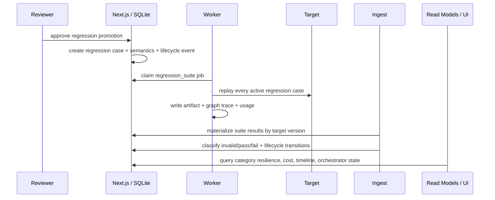
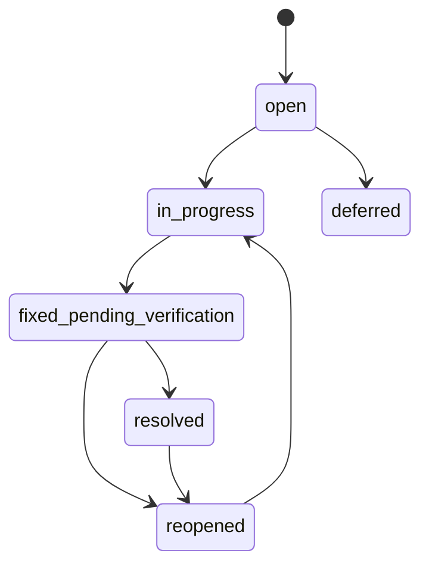
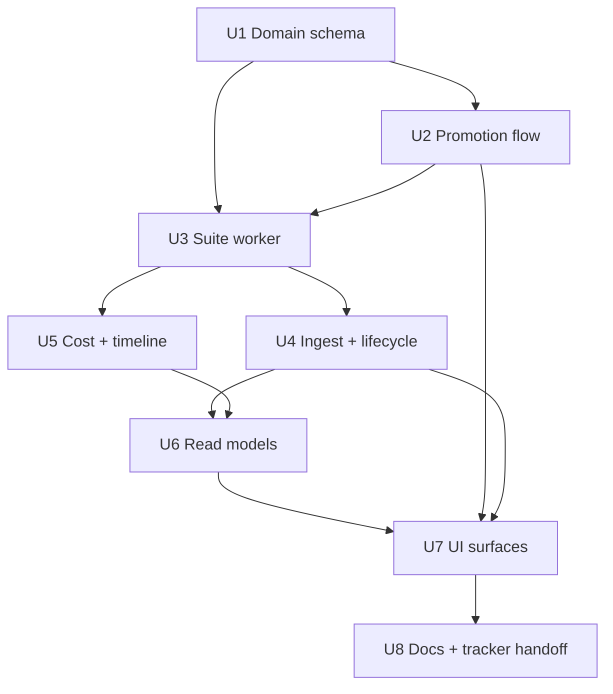

# feat: Add Regression Harness and Observability

## Summary

Build a dedicated confirmed-exploit regression lifecycle on top of the existing Boundary Labs campaign, worker, ingest, and dashboard foundations. The implementation adds promoted regression cases with explicit pass semantics, target-versioned regression suite execution, vulnerability reappearance and cross-category regression detection, and queryable observability for category resilience, cost, and ordered agent activity.

---

## Problem Frame

The current platform can run seed-based campaigns and ingest attempts, verdicts, findings, and basic dashboard read models. It cannot yet prove that a confirmed exploit stayed fixed across target versions because promoted regression cases, trustworthy replay semantics, target-versioned result history, lifecycle transitions, cost records, and ordered agent activity are not modeled as first-class state. See origin: `docs/brainstorms/2026-05-15-regression-harness-observability-assessment-requirements.md`.

---

## Requirements

- R1. Confirmed exploits are promoted into dedicated, versioned, queryable regression case records separate from exploratory seed cases.
- R2. Regression cases carry explicit pass semantics: protected behavior, required evidence, invalid-result conditions, deterministic checks, and judge rubric.
- R3. Regression replay distinguishes true pass from invalid pass caused by drift, missing evidence, target unavailability, prompt rewrite, judge uncertainty, or bypass of the original vulnerable path.
- R4. The Orchestrator can trigger a full regression suite containing every active promoted regression case.
- R5. Regression suite results are stored per target system version for comparison across versions and deployments.
- R6. A previously fixed regression case that fails later reopens the vulnerability and is flagged as reappeared.
- R7. A previously passing regression in another category that fails after a new fix is flagged as a cross-category regression.
- R8. Observability exposes separate counts for exploratory seeds, confirmed regression cases, attempted cases, passing cases, failing cases, partial cases, and invalid cases.
- R9. Observability exposes pass/fail/partial/invalid rates by category, run, regression suite, and target system version.
- R10. Observability exposes resilience trends over time using fixed baselines, reopened vulnerabilities, new failures, and category-level movement.
- R11. Vulnerability lifecycle distinguishes open, in progress, fixed pending verification, resolved, reopened, and deferred with timestamps and run evidence.
- R12. Each test run records cost data sufficient for total run cost, cost by agent/model/category, token usage where available, and cost scaling.
- R13. Agent activity is observable as an ordered timeline with role, action, input reference, output reference, status, cost when available, and trace or artifact correlation.
- R14. The Orchestrator-facing read model provides structured state to decide whether to run regressions, explore gaps, stop for low signal, or escalate to a human.

**Origin actors:** A1 (Orchestrator Agent), A2 (Red Team Agent), A3 (Judge Agent), A4 (Documentation Agent), A5 (Human Operator / Reviewer), A6 (Target System).

**Origin acceptance examples:** AE1 (promotion), AE2 (invalid pass), AE3 (full sweep by target version), AE4 (reopened vulnerability), AE5 (cross-category regression), AE6 (observability rates/trends), AE7 (cost breakdown), AE8 (agent timeline).

---

## Scope Boundaries

- Exploratory seed execution remains distinct from confirmed-exploit regression testing; this plan does not collapse `evals/seeds/` into the regression suite.
- Raw artifacts remain evidence references. Queryable observability comes from persisted rows and read models, not from operators reading raw JSON.
- The plan does not require a new external queue, separate worker service, or Postgres migration; it extends the existing SQLite + Python worker + artifact design.
- The plan does not make Judge verdicts authoritative by themselves for promoted regressions; deterministic evidence and invalid-result handling are required where the promoted case declares them.
- UI work is limited to operator and Orchestrator observability for the new state. It does not redesign the visual system or add unrelated reporting exports.

### Deferred to Follow-Up Work

- Historical backfill from old `evals/results/` artifacts into target-versioned regression history: possible after the schema exists, but not required for first correct behavior.
- Alerting or Slack notifications for reopened vulnerabilities: useful follow-up once the read model is stable.
- Provider price catalog automation: this plan stores usage and supports configured rates; automatic current-provider price syncing can land later.
- Full OpenTelemetry collector export: the worker already has optional Logfire/OTel instrumentation; this plan persists the local subset needed for product observability first.

---

## Context & Research

### Relevant Code and Patterns

- `apps/web/src/server/db/migrations/0001_init.sql`, `apps/web/src/server/db/migrate.ts`, and `apps/web/tests/db/migrations.test.ts` establish idempotent SQLite migrations, schema bootstrap, and DB-bound tests.
- `apps/web/src/server/ingest/from-artifact.ts` and `apps/web/tests/ingest/from-artifact.test.ts` are the public ingest boundary for materializing artifacts into queryable state.
- `apps/web/src/server/campaigns/repository.ts`, `apps/web/src/server/jobs/repository.ts`, `worker/queue.py`, and `worker/main.py` provide the existing queue, claim-token, campaign job, and worker execution patterns.
- `worker/graphs/campaign.py` already writes graph traces, agent connection snapshots, provider usage when available, inter-agent messages, generated cases, and campaign artifacts.
- `scripts/run_mvp_evals.py` and `worker/graphs/campaign.py` contain deterministic verdict checks for prohibited patterns, safe indicators, transport errors, and invalid result states.
- `apps/web/src/server/coverage/query.ts`, `apps/web/src/server/metrics/repository.ts`, `apps/web/src/server/runs/repository.ts`, `apps/web/src/server/findings/repository.ts`, and `apps/web/src/server/agents/repository.ts` are thin read-model examples to extend rather than bypass.
- `apps/web/src/app/(app)/dashboard/page.tsx`, `apps/web/src/app/(app)/findings/page.tsx`, `apps/web/src/app/(app)/campaigns/[campaignId]/page.tsx`, and `apps/web/src/app/(app)/seeds/[seedId]/page.tsx` already expose the related operator surfaces.
- `apps/web/src/server/safety-gate/schema.ts` already names `orchestrator:regression_sweep` and `regression:promote`, which should be enforced rather than replaced.

### Institutional Learnings

- No `docs/solutions/` directory exists in this repo yet.
- Linear has an existing project, **Boundary Labs Platform Buildout**, tracking this repo and prior plan work. The new plan should stay compatible with that project and can be turned into tracked THE issues after plan handoff.

### External References

- OWASP GenAI Security Project frames LLM application security as a maintained body of guidance for risks across LLM and agentic applications: https://owasp.org/www-project-top-10-for-large-language-model-applications/
- OWASP Gen AI Red Teaming Guide announcement emphasizes risk-based red teaming, system-integration pitfalls, and continuous monitoring: https://genai.owasp.org/2025/01/22/announcing-the-owasp-gen-ai-red-teaming-guide/
- NIST AI RMF and the 2024 Generative AI Profile support lifecycle risk management, evaluation, and monitoring of AI systems: https://www.nist.gov/itl/ai-risk-management-framework
- OpenTelemetry GenAI metrics define token usage and operation duration conventions that map cleanly to local run-cost records: https://opentelemetry.io/docs/specs/semconv/gen-ai/gen-ai-metrics/
- OpenTelemetry GenAI spans define input/output token attributes, provider/model identity, and content-reference concerns that map to agent activity rows: https://opentelemetry.io/docs/specs/semconv/gen-ai/gen-ai-spans/
- Pydantic AI documentation supports Logfire/OpenTelemetry instrumentation with content capture disabled and exposes usage, latency, and errors through supported result/instrumentation paths.

---

## Key Technical Decisions

- Dedicated regression tables separate from seeds: Regression cases, versions, pass semantics, suites, suite cases, and suite results should live in their own domain tables. `seeds` and `seed_versions` remain exploratory corpus state; regression cases may reference a seed or generated case but do not inherit seed pass semantics.
- Promotion is reviewer-approved and transactional: Use the existing `approvals` and Safety Gate action model for `regression:promote`, then write the regression case/version, lifecycle event, audit event, and optional case file in one transaction.
- Pass semantics are data, not code comments: Store required evidence and invalid conditions as structured JSON with an explicit schema so ingest can evaluate missing-path, drift, target failure, and judge-uncertainty cases as `invalid`.
- Target version is mandatory for trustworthy regression history: Regression suite jobs should carry an explicit target version identifier from job payload or runtime configuration. When absent, persist an `unknown` target-version row and mark results unsuitable for resilience comparisons rather than silently treating URL or timestamp as a real version.
- Regression suite execution extends the existing worker graph: Add a regression case source and `regression_suite` job type to the existing queue/worker shape instead of adding another runner path.
- Ingest owns lifecycle transitions: `from-artifact.ts` should classify regression results, update lifecycle events, reopen findings, and flag cross-category regressions while keeping raw artifacts immutable.
- Cost observability uses provider usage first, configured estimates second: Persist raw token/usage fields from Pydantic AI where present, store the estimation source, and keep cost totals honest when usage is unavailable.
- Agent timeline is materialized from graph traces and inter-agent messages: Persist timeline rows during ingest from `pydantic_graph.trace_path`, `agent_connections`, `inter_agent_messages`, and per-result agent sections so dashboards do not parse artifacts on every request.
- Operator UI consumes new read models only: Dashboard and detail pages should use repository functions for regression coverage, resilience, cost, and agent timelines, preserving the existing UI boundary.

---

## Alternative Approaches Considered

- Extend `seeds` and `seed_versions` to represent confirmed regressions: rejected because exploratory corpus state and confirmed-exploit replay have different approval, pass-semantics, lifecycle, and target-version requirements. Reusing the same tables would make seed coverage look more trustworthy than it is.
- Add a separate regression runner process: rejected for first implementation because the existing worker already owns queue claiming, graph execution, sentinels, artifact writing, provider usage, and recovery behavior. A second runner would duplicate the most failure-prone parts.
- Keep resilience and timeline observability artifact-only: rejected because the origin requires Orchestrator and operator decisions without raw artifact inspection, and artifact parsing on every dashboard render would make correctness and performance harder to reason about.
- Require provider-reported cost for all runs before displaying cost: rejected because current provider usage may be partially unavailable. Storing provenance lets the UI distinguish reported, estimated, and unavailable cost honestly while still showing scaling trends where data exists.

---

## Open Questions

### Resolved During Planning

- Storage boundary for promoted regression cases versus exploratory seeds: dedicated regression tables and optional `evals/cases/regression/` files for portable case definitions; seeds remain exploratory.
- Deterministic versus judge-assisted pass semantics: deterministic evidence checks are required where cases provide prohibited/safe indicators, path exercise requirements, or artifact event expectations; judge-assisted rubric may refine pass/fail but cannot convert missing required evidence into pass.
- Authoritative target version identifier: explicit job payload/runtime value is authoritative; fallback `unknown` is queryable but excluded from resilience comparisons.
- Provider usage fields for cost breakdown: Pydantic AI usage fields and graph `agent_connections.*.usage` are the first source; configured estimate rows fill gaps with provenance.

### Deferred to Implementation

- Exact JSON shape for each pass-semantics field after aligning with current artifact payloads and test fixtures.
- Exact target-version payload key after checking deploy/runtime environment names used by the Clinical Co-Pilot deployment.
- Exact per-provider price fields and default rates after confirming what current provider usage returns in local proof artifacts.
- Whether regression case files are written immediately on promotion or only exported after first successful replay; both keep DB as source of truth.

---

## High-Level Technical Design

> *This illustrates the intended approach and is directional guidance for review, not implementation specification. The implementing agent should treat it as context, not code to reproduce.*

---

## Implementation Units

### U1. Regression Domain Schema and Repositories

**Goal:** Add the persisted domain model for target versions, regression cases, pass semantics, suites, suite results, lifecycle events, cost records, and agent timeline rows.

**Requirements:** R1, R2, R5, R8, R9, R10, R11, R12, R13

**Dependencies:** None

**Files:**
- Create: `apps/web/src/server/db/migrations/0004_regression_harness_observability.sql`
- Modify: `apps/web/src/server/db/schema.ts`
- Create: `apps/web/src/server/regression-cases/repository.ts`
- Create: `apps/web/src/server/regression-suites/repository.ts`
- Create: `apps/web/src/server/target-versions/repository.ts`
- Create: `apps/web/src/server/vulnerability-lifecycle/repository.ts`
- Create: `apps/web/src/server/costs/repository.ts`
- Create: `apps/web/src/server/agent-timeline/repository.ts`
- Test: `apps/web/tests/db/regression-schema.test.ts`
- Test: `apps/web/tests/repositories/regression-domain.test.ts`

**Approach:**
- Keep domain responsibilities narrow: regression case storage does not calculate lifecycle; lifecycle repository records transitions; suite repository stores execution/result rows; read models aggregate later.
- Add indexes around target version, category, case status, suite run, and lifecycle status transitions because dashboard and Orchestrator queries will filter by those dimensions.
- Store pass semantics and provider usage as structured JSON with validation at repository boundaries so migration stays additive and SQLite remains simple.
- Preserve append-only audit behavior by writing promotion, lifecycle, and suite materialization events to `audit_events` rather than mutating old audit rows.

**Execution note:** Start with failing DB and repository tests that prove the public repository contracts and migration idempotence before adding production repository code.

**Patterns to follow:**
- `apps/web/src/server/db/migrations/0001_init.sql`
- `apps/web/src/server/db/migrate.ts`
- `apps/web/tests/db/migrations.test.ts`
- `apps/web/src/server/seeds/repository.ts`

**Test scenarios:**
- Happy path: Fresh DB bootstrap creates all regression, lifecycle, cost, target-version, and timeline tables and indexes without disturbing existing tables.
- Happy path: Repository creates an active regression case linked to a finding, approval, category, severity, target version, and pass-semantics payload; fetching by ID returns the same observable fields.
- Happy path: Repository creates a regression suite row with multiple active case links and target version reference.
- Happy path: Repository stores pass, fail, partial, and invalid suite result rows against a suite and target version.
- Edge case: Re-running migrations is a no-op and does not duplicate indexes or seed data.
- Error path: Creating a regression result for a missing case or target version fails through foreign-key enforcement.
- Integration: Lifecycle repository appends transitions with evidence run references and can return the latest lifecycle state without mutating prior events.

**Verification:**
- DB bootstrap includes the new tables.
- Repository tests prove the public domain boundary without importing private helpers.
- Existing migration and read-model tests still pass.

---

### U2. Reviewer Promotion Flow

**Goal:** Turn approved confirmed findings into durable regression cases with explicit pass semantics and audit/lifecycle history.

**Requirements:** R1, R2, R11; AE1

**Dependencies:** U1

**Files:**
- Create: `apps/web/src/server/regression-cases/pass-semantics.ts`
- Create: `apps/web/src/server/regression-cases/promotion.ts`
- Modify: `apps/web/src/server/approvals/repository.ts`
- Modify: `apps/web/src/server/safety-gate/schema.ts`
- Modify: `apps/web/src/app/(app)/approvals/actions.ts`
- Modify: `apps/web/src/app/(app)/approvals/[approvalId]/page.tsx`
- Modify: `apps/web/src/app/(app)/findings/[findingId]/page.tsx`
- Create: `evals/cases/regression/.gitkeep`
- Test: `apps/web/tests/regression/promotion.test.ts`
- Test: `apps/web/tests/approvals/regression-promotion.test.ts`

**Approach:**
- Add a promotion service that reads the approved finding, source attempt/verdict/evidence, and approval payload, then writes the regression case/version and initial lifecycle event in one transaction.
- Validate pass semantics at promotion time: protected behavior, required evidence, invalid-result conditions, deterministic checks, and judge rubric must be present enough for replay to classify `invalid` when evidence is missing.
- Keep optional file export behind the promotion service so the DB remains authoritative but `evals/cases/regression/` can become a portable corpus.
- Extend approval detail UI enough for reviewers to see the linked finding, evidence summary, and pass semantics before approving.

**Execution note:** Add a failing promotion integration test through approval/public service boundaries before implementing the promotion service.

**Patterns to follow:**
- `apps/web/src/server/approvals/repository.ts`
- `apps/web/tests/approvals/approve-reject.test.ts`
- `apps/web/src/server/safety-gate/evaluate.ts`
- `apps/web/src/app/(app)/findings/[findingId]/page.tsx`

**Test scenarios:**
- Covers AE1. Given an approved regression promotion for a confirmed exploit, the service creates one active regression case linked to finding, original evidence, approval, category, severity, target version, and pass semantics.
- Happy path: Promotion writes an audit event and a lifecycle transition from open or fixed-pending-verification into fixed-pending-verification with evidence references.
- Edge case: Replaying the same approved promotion is idempotent and does not create duplicate active cases.
- Error path: Promotion payload missing required pass-semantics evidence is rejected and leaves no partial regression case.
- Error path: Approval canonical hash mismatch prevents promotion and writes the existing approval mismatch audit.
- Integration: Approval UI action calls the promotion path and the finding detail page shows the promoted regression link/state.

**Verification:**
- Reviewer approval can promote a finding into a regression case through the existing approval flow.
- Promotion cannot bypass Safety Gate or canonical-hash validation.

---

### U3. Regression Suite Worker Execution

**Goal:** Let the Orchestrator or an operator enqueue and run a full regression suite containing every active promoted regression case against a target version.

**Requirements:** R3, R4, R5, R14; AE2, AE3

**Dependencies:** U1, U2

**Files:**
- Modify: `apps/web/src/server/campaigns/repository.ts`
- Modify: `apps/web/src/server/jobs/repository.ts`
- Modify: `apps/web/src/server/config.ts`
- Modify: `apps/web/.env.example`
- Modify: `worker/config.py`
- Modify: `worker/queue.py`
- Modify: `worker/main.py`
- Modify: `worker/cron.py`
- Modify: `worker/fallback/orchestrator.py`
- Modify: `worker/graphs/campaign.py`
- Create: `worker/regression_cases.py`
- Modify: `scripts/run_mvp_evals.py`
- Test: `apps/web/tests/regression/suite-enqueue.test.ts`
- Test: `worker/tests/test_cron.py`
- Test: `worker/tests/test_regression_suite_job.py`
- Test: `worker/tests/test_regression_cases.py`
- Test: `worker/tests/test_worker_tick.py`

**Approach:**
- Add a `regression_suite` job type that loads active regression cases from SQLite instead of exploratory seeds and carries a target version reference in job payload.
- Extend worker job dispatch without disrupting `campaign_run` behavior; claim-token and revoked-operator safeguards stay unchanged.
- Reuse the graph execution path where possible by adding a case-source abstraction at the worker boundary, not by duplicating the graph.
- Make target version explicit in the artifact and suite result metadata. Unknown target versions are allowed for execution but marked unusable for resilience comparisons.
- Add Orchestrator sweep scheduling by changing `worker/cron.py` from a permanent false stub into a policy/cadence-aware enqueue path for regression suites.

**Execution note:** Characterize existing `campaign_run` worker behavior first, then add failing tests for `regression_suite` job dispatch and sweep enqueue.

**Patterns to follow:**
- `worker/main.py`
- `worker/queue.py`
- `worker/tests/test_main_process_job.py`
- `worker/graphs/campaign.py`
- `apps/web/src/server/safety-gate/schema.ts`

**Test scenarios:**
- Covers AE3. Given active promoted regression cases and a target version, when Orchestrator triggers a sweep, a `regression_suite` job is queued and the worker executes every active case.
- Covers AE2. Given a regression replay does not exercise the required vulnerable path, worker artifact marks the case result `invalid` rather than `pass`.
- Happy path: `campaign_run` jobs continue using exploratory seed cases and are not included in regression suite counts.
- Edge case: No active regression cases produces a completed empty suite with a structured no-cases audit event, not a failed worker job.
- Edge case: Missing target version persists `unknown` target version and marks the suite excluded from trend comparisons.
- Error path: Malformed regression case payload fails the suite job with a clear sentinel/audit reason and does not corrupt existing cases.
- Integration: Worker trace and artifact include suite ID, target version, case source, and result status for each active case.

**Verification:**
- Existing campaign worker tests still pass.
- New regression suite job tests prove full-suite execution and target-version storage.
- Orchestrator sweep no longer depends on manual campaign selection.

---

### U4. Ingest Classification, Lifecycle Reopen, and Cross-Category Regression Detection

**Goal:** Materialize regression suite artifacts into target-versioned suite results, classify invalid passes, reopen vulnerabilities, and flag cross-category regressions.

**Requirements:** R3, R5, R6, R7, R10, R11, R14; AE2, AE4, AE5

**Dependencies:** U1, U2, U3

**Files:**
- Modify: `apps/web/src/server/ingest/types.ts`
- Modify: `apps/web/src/server/ingest/from-artifact.ts`
- Modify: `apps/web/src/server/ingest/sweep.ts`
- Create: `apps/web/src/server/regression-suites/classify-result.ts`
- Create: `apps/web/src/server/regression-suites/lifecycle.ts`
- Modify: `apps/web/src/server/findings/repository.ts`
- Modify: `apps/web/src/server/campaigns/types.ts`
- Test: `apps/web/tests/ingest/regression-artifact.test.ts`
- Test: `apps/web/tests/regression/result-classification.test.ts`
- Test: `apps/web/tests/findings/lifecycle.test.ts`

**Approach:**
- Extend artifact parsing to accept regression suite metadata while preserving existing campaign artifact compatibility.
- Classify result status by combining artifact verdict, pass semantics, required evidence, invalid conditions, target availability, and judge confidence. Missing required evidence wins over superficially safe text.
- Compare each regression result against the case baseline and previous target-version results to detect reappearance.
- Detect cross-category regression when a previously passing active regression outside the fixed category fails on a later target version in the same suite or deployment window.
- Store lifecycle transitions as events and update finding read models from latest transition rather than overloading the current `findings.status` values.

**Execution note:** Add regression tests for invalid-pass and reopen behavior before modifying ingest.

**Patterns to follow:**
- `apps/web/src/server/ingest/from-artifact.ts`
- `apps/web/tests/ingest/from-artifact.test.ts`
- `apps/web/src/server/findings/repository.ts`
- `apps/web/tests/repositories/read-models.test.ts`

**Test scenarios:**
- Covers AE2. Required evidence missing with a safe-looking target response results in persisted `invalid`, not `pass`.
- Covers AE4. A regression case that previously passed after fix verification and later fails creates a `reopened` lifecycle transition and surfaces the finding as reopened.
- Covers AE5. A category B case that previously passed and fails after a category A fix is flagged as `cross_category_regression`.
- Happy path: Passing regression result after fixed-pending-verification increments verification evidence and can transition to resolved when policy threshold is met.
- Edge case: Target unavailable or transport timeout results in `invalid` and does not reopen the vulnerability.
- Edge case: Judge uncertainty below threshold results in `invalid` or review-needed state according to case semantics.
- Error path: Re-ingesting the same regression artifact is idempotent and does not duplicate suite results or lifecycle events.
- Integration: `listFindings()` includes open, in progress, fixed pending verification, resolved, reopened, and deferred states without breaking existing finding consumers.

**Verification:**
- Ingest can materialize both legacy campaign artifacts and regression suite artifacts.
- Reopened and cross-category states are visibly distinct in persisted read models.

---

### U5. Cost and Agent Timeline Materialization

**Goal:** Persist cost and ordered agent activity from worker artifacts and traces so operators can understand what each agent did, in what order, and what it cost.

**Requirements:** R12, R13; AE7, AE8

**Dependencies:** U1, U3, U4

**Files:**
- Modify: `worker/graphs/campaign.py`
- Modify: `worker/llm_provider.py`
- Modify: `policy_seed.json`
- Modify: `apps/web/src/server/ingest/from-artifact.ts`
- Create: `apps/web/src/server/costs/costing.ts`
- Create: `apps/web/src/server/agent-timeline/from-trace.ts`
- Modify: `apps/web/src/server/agents/repository.ts`
- Modify: `apps/web/src/server/runs/repository.ts`
- Test: `worker/tests/test_graphs_campaign.py`
- Test: `worker/tests/test_llm_provider.py`
- Test: `apps/web/tests/ingest/cost-and-timeline.test.ts`
- Test: `apps/web/tests/repositories/agent-timeline.test.ts`

**Approach:**
- Preserve Pydantic AI's supported `usage()` fields and graph trace events as the source of truth for token and request counts.
- Add local cost estimation at ingest/read-model time using configured provider/model rates and store whether each cost is provider-reported, estimated from tokens, or unavailable.
- Parse graph trace JSONL into ordered timeline rows with stable artifact references rather than rendering raw trace files.
- Keep content capture disabled by default for privacy; timeline input/output references point to artifact paths, trace paths, case IDs, or provider note summaries rather than full prompt text.

**Execution note:** Begin with fixture artifacts containing usage, no usage, failed agent calls, and trace events so cost provenance is test-covered before production changes.

**Patterns to follow:**
- `worker/graphs/campaign.py`
- `worker/llm_provider.py`
- `apps/web/src/server/agents/repository.ts`
- `docs/runbooks/provider-proof-campaign.md`

**Test scenarios:**
- Covers AE7. Given a campaign with multiple agent/model usage records, ingest stores total run cost and cost broken down by agent, model, and category.
- Covers AE8. Given a graph trace with Orchestrator, Red Team, Target Execution, Judge, Documentation, and Promotion actions, the read model returns the ordered sequence with artifact/trace references.
- Happy path: Usage with input/output tokens and requests stores token counts and estimated cost with model/provider identity.
- Edge case: Agent call with no usage stores an unavailable or estimate-only cost row and does not fabricate token counts.
- Edge case: Failed or timed-out agent call appears in the timeline with failed status and duration/error type.
- Error path: Missing trace file does not fail ingest; agent connection summary still produces timeline rows with degraded provenance.
- Integration: Timeline rows correlate to run ID, suite ID when present, case ID when present, and trace path.

**Verification:**
- Operators can query total cost, cost by agent/model/category, and ordered agent activity without opening raw artifacts.
- Cost records clearly distinguish actual usage from estimates.

---

### U6. Regression and Observability Read Models

**Goal:** Provide repository read models for category coverage, pass/fail rates, resilience trends, vulnerability lifecycle, cost scaling, agent timeline, and Orchestrator decision state.

**Requirements:** R8, R9, R10, R11, R12, R13, R14; AE6, AE7, AE8

**Dependencies:** U1, U4, U5

**Files:**
- Create: `apps/web/src/server/regression-observability/repository.ts`
- Create: `apps/web/src/server/orchestrator-state/repository.ts`
- Modify: `apps/web/src/server/coverage/query.ts`
- Modify: `apps/web/src/server/metrics/repository.ts`
- Modify: `apps/web/src/server/findings/repository.ts`
- Modify: `apps/web/src/server/runs/repository.ts`
- Modify: `apps/web/src/server/targets/repository.ts`
- Modify: `apps/web/src/server/campaigns/types.ts`
- Test: `apps/web/tests/repositories/regression-observability.test.ts`
- Test: `apps/web/tests/repositories/orchestrator-state.test.ts`
- Test: `apps/web/tests/repositories/read-models.test.ts`

**Approach:**
- Add new read-model functions instead of mixing all aggregation into dashboard components.
- Split exploratory seed counts from confirmed regression case counts and include attempted/pass/fail/partial/invalid buckets.
- Expose rate breakdowns by category, run, suite, and target version with `unknown` target versions clearly marked.
- Compute resilience trend from fixed baselines, reopened transitions, new failures, invalid counts, and category-level movement.
- Build an Orchestrator-facing state summary with active regression count, stale categories, recent reopened cases, invalid-result rate, cost trend, and human-escalation indicators.

**Execution note:** Write read-model tests against seeded DB fixtures that include multiple target versions and lifecycle transitions before adding UI consumers.

**Patterns to follow:**
- `apps/web/src/server/coverage/query.ts`
- `apps/web/src/server/metrics/repository.ts`
- `apps/web/tests/repositories/read-models.test.ts`

**Test scenarios:**
- Covers AE6. Given runs across multiple target versions, read models return category counts, pass/fail rates by version, and resilience movement.
- Covers AE7. Cost trend read model returns total cost and cost by agent/model/category over time.
- Covers AE8. Agent timeline read model returns ordered actions for a run or suite.
- Happy path: Coverage read model distinguishes exploratory seeds from confirmed regression cases in the same category.
- Edge case: Categories with no regression cases still appear with seed counts and regression count zero.
- Edge case: Target version `unknown` is included in raw counts but excluded or flagged in resilience trend comparisons.
- Error path: Empty database returns empty arrays/zero counts without throwing, matching existing repository behavior.
- Integration: Orchestrator state identifies when to run regressions, explore coverage gaps, stop due to low signal, or escalate to a human.

**Verification:**
- Read-model tests cover every operator and Orchestrator question from the origin requirements.
- Existing dashboard metrics remain compatible until UI unit consumes the richer data.

---

### U7. Operator and Orchestrator UI Surfaces

**Goal:** Expose regression coverage, resilience, lifecycle, cost, and agent timeline in the console using existing page/component patterns.

**Requirements:** R8, R9, R10, R11, R12, R13, R14; AE4, AE5, AE6, AE7, AE8

**Dependencies:** U2, U4, U5, U6

**Files:**
- Modify: `apps/web/src/app/(app)/dashboard/page.tsx`
- Modify: `apps/web/src/app/(app)/findings/page.tsx`
- Modify: `apps/web/src/app/(app)/findings/[findingId]/page.tsx`
- Modify: `apps/web/src/app/(app)/campaigns/[campaignId]/page.tsx`
- Modify: `apps/web/src/app/(app)/seeds/[seedId]/page.tsx`
- Modify: `apps/web/src/components/boundary/app-shell.tsx`
- Create: `apps/web/src/app/(app)/regressions/page.tsx`
- Create: `apps/web/src/app/(app)/regressions/[caseId]/page.tsx`
- Create: `apps/web/src/components/boundary/regression-status-pill.tsx`
- Create: `apps/web/src/components/boundary/agent-timeline.tsx`
- Create: `apps/web/src/components/boundary/cost-breakdown.tsx`
- Test: `apps/web/tests/regression/ui-read-models.test.ts`
- Test: `apps/web/tests/e2e/regression-observability.spec.ts`

**Approach:**
- Keep UI dense and operational, consistent with the existing Boundary Labs console. Use existing panels, chips, verdict pills, and tables; add only small focused components for regression status, cost, and timeline.
- Add a `/regressions` surface for the active suite/case inventory while linking from existing dashboard, finding, seed, and campaign detail pages.
- Surface reopened and cross-category regression states with distinct labels and evidence links.
- Add cost and timeline sections to run/suite detail pages, not as raw artifact dumps.
- Show Orchestrator decision state as structured inputs: active cases, stale categories, recent reopened vulnerabilities, invalid-rate warnings, and cost/budget pressure.

**Execution note:** Add component/E2E tests around rendered states from seeded read models before wiring the pages.

**Patterns to follow:**
- `apps/web/src/app/(app)/dashboard/page.tsx`
- `apps/web/src/app/(app)/campaigns/[campaignId]/page.tsx`
- `apps/web/src/components/boundary/panel.tsx`
- `apps/web/src/components/boundary/verdict-pill.tsx`

**Test scenarios:**
- Covers AE4. A reopened vulnerability appears as reopened on findings list/detail and links to the failed regression suite result.
- Covers AE5. A cross-category regression appears distinctly from a generic failed verdict and names the prior passing category context.
- Covers AE6. Dashboard or regressions page shows category counts, pass/fail rates by version, and resilience improvement/decline.
- Covers AE7. Run or suite detail shows total cost plus agent/model/category breakdown.
- Covers AE8. Run timeline shows ordered Orchestrator, Red Team, Target Execution, Judge, Documentation, and Promotion actions with references.
- Edge case: Unknown target version is visually marked and not shown as trustworthy resilience trend.
- Edge case: Empty regression suite inventory shows an actionable empty state without implying seed coverage is regression coverage.
- Integration: Navigation between finding, regression case, suite result, run, and seed remains coherent.

**Verification:**
- UI renders the required observability questions from read models.
- Browser/E2E coverage validates the main operator flows without relying on live external providers.

---

### U8. Documentation, Operations, and Tracker Handoff

**Goal:** Document the regression harness contract, target-version and cost configuration, operator interpretation of invalid/reopened states, and create tracked implementation issues from the plan.

**Requirements:** R1-R14 support; success criteria handoff

**Dependencies:** U1-U7

**Files:**
- Modify: `evals/README.md`
- Create: `docs/runbooks/regression-harness.md`
- Modify: `docs/runbooks/provider-proof-campaign.md`
- Modify: `ARCHITECTURE.md`
- Test: `apps/web/tests/docs/regression-doc-links.test.ts`

**Approach:**
- Document the distinction between exploratory seeds and promoted regression cases so future agents do not regress the model.
- Document target-version requirements and the behavior of `unknown` target versions.
- Document pass, fail, partial, and invalid semantics for promoted cases.
- Document cost provenance: provider-reported usage, estimated token cost, and unavailable cost.
- Use the existing Linear project **Boundary Labs Platform Buildout** for implementation issue tracking after plan acceptance; break issues along U-IDs.

**Execution note:** Treat docs tests as link/existence checks only; do not over-test prose.

**Patterns to follow:**
- `evals/README.md`
- `docs/runbooks/provider-proof-campaign.md`
- Existing Linear project: Boundary Labs Platform Buildout

**Test scenarios:**
- Happy path: Docs describe how confirmed exploits are promoted and replayed without conflating them with exploratory seeds.
- Happy path: Docs describe target-version configuration and explain why unknown target versions are excluded from resilience comparisons.
- Happy path: Docs describe invalid-result semantics and cost provenance.
- Edge case: Link check proves referenced regression docs and pages exist.

**Verification:**
- A future implementer can understand promotion, replay, lifecycle, cost, and timeline semantics without rereading raw requirements.
- Plan U-IDs can be converted directly into Linear issues.

---

## System-Wide Impact

- **Interaction graph:** Promotion touches approvals, Safety Gate, findings, regression case repositories, audit, optional case-file export, worker queue, ingest, and UI read models.
- **Error propagation:** Worker job failures remain sentinel/audit based; regression case semantic failures become suite results, while target or evidence insufficiency becomes `invalid` and does not automatically reopen vulnerabilities.
- **State lifecycle risks:** The main risk is accidental double materialization during ingest. Natural keys and lifecycle event idempotency must be explicit for suite results and transitions.
- **API surface parity:** Operator UI, Orchestrator read model, and worker execution must all agree on active regression cases, target version, and case status.
- **Integration coverage:** Unit tests alone will not prove promotion-to-suite-to-ingest-to-lifecycle. At least one integration fixture should execute the full path through public service/repository boundaries.
- **Unchanged invariants:** Existing exploratory campaign execution, seed bootstrap, audit append-only enforcement, claim-token behavior, and artifact path jail must continue to work.

---

## Risk Analysis & Mitigation

| Risk | Mitigation |
|------|------------|
| Regression pass semantics become too weak and produce false confidence | Store required evidence and invalid conditions as first-class data; test missing-evidence and drift as `invalid`. |
| Target version is unavailable or ambiguous | Require explicit target version for trustworthy comparison; persist `unknown` but exclude or flag it in trends. |
| Ingest becomes too large and hard to reason about | Extract classification and lifecycle modules with clear repository boundaries; keep `from-artifact.ts` as orchestration. |
| Cost estimates are mistaken for provider billing truth | Store provenance for every cost row and render unknown/estimated separately from provider-reported values. |
| UI makes seed coverage look like regression coverage | Split seed and regression counts in the read model and display labels. |
| Graph trace content leaks sensitive prompt or response text into telemetry | Persist references and summaries by default; keep content capture disabled unless explicitly configured. |
| Orchestrator acts on stale or partial read models | Add Orchestrator state tests with empty, stale, invalid-heavy, reopened, and budget-pressure cases. |

---

## Documentation / Operational Notes

- Add docs before or alongside UI completion so operators know `invalid` is a trustworthy outcome, not a flaky failure.
- Target version configuration should be treated as a deployment prerequisite for reliable regression trends.
- Cost rows should display whether the value is provider-reported, estimated, or unavailable.
- The plan should be tracked in Linear under the existing **Boundary Labs Platform Buildout** project after handoff.

---

## Success Metrics

- A reviewer can promote a confirmed exploit and later query whether it stayed fixed across target versions.
- A regression sweep executes every active promoted case and stores results against the suite and target version.
- Missing required evidence produces `invalid`, not `pass`.
- Reopened and cross-category regression states are distinct in read models and UI.
- Operators can answer category coverage, pass/fail rates, resilience trend, lifecycle state, run cost, cost scaling, and ordered agent activity from console/read models.
- Orchestrator state can decide between regression sweep, coverage exploration, low-signal stop, and human escalation without raw artifact inspection.

---

## Sources & References

- **Origin document:** [docs/brainstorms/2026-05-15-regression-harness-observability-assessment-requirements.md](../brainstorms/2026-05-15-regression-harness-observability-assessment-requirements.md)
- **Prior platform plan:** [docs/plans/2026-05-13-001-feat-platform-buildout-plan.md](2026-05-13-001-feat-platform-buildout-plan.md)
- Related code: `apps/web/src/server/ingest/from-artifact.ts`
- Related code: `worker/graphs/campaign.py`
- Related code: `apps/web/src/server/coverage/query.ts`
- Related code: `apps/web/src/server/safety-gate/schema.ts`
- External: OWASP GenAI Security Project, https://owasp.org/www-project-top-10-for-large-language-model-applications/
- External: OWASP Gen AI Red Teaming Guide announcement, https://genai.owasp.org/2025/01/22/announcing-the-owasp-gen-ai-red-teaming-guide/
- External: NIST AI Risk Management Framework, https://www.nist.gov/itl/ai-risk-management-framework
- External: OpenTelemetry GenAI metrics, https://opentelemetry.io/docs/specs/semconv/gen-ai/gen-ai-metrics/
- External: OpenTelemetry GenAI spans, https://opentelemetry.io/docs/specs/semconv/gen-ai/gen-ai-spans/
